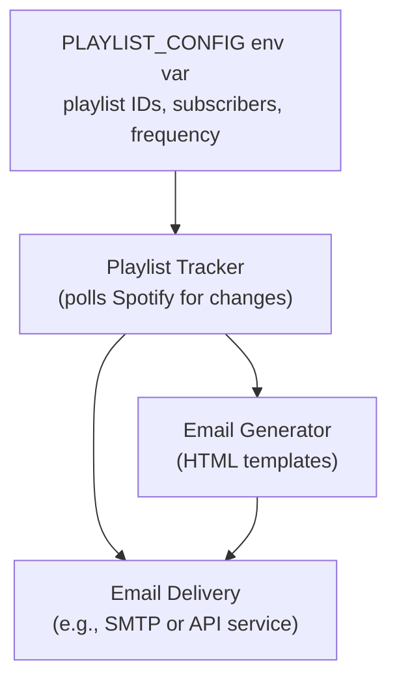

# Spotify Recap

Spotify Recap is a planned service that tracks curated playlists and emails subscribers about new additions.
The project loads playlist and subscriber configuration from an environment variable and sends periodic update emails
with details like who added a song and relevant genre information.

## Architecture Overview



- **Configuration**: playlist IDs, subscriber emails, and a `frequency` field are supplied via
  a `PLAYLIST_CONFIG` environment variable containing YAML. Using environment variables keeps
  sensitive subscriber data out of version control and enables integration with secret managers.
- **Playlist Tracker**: Queries the Spotify API to detect additions to each playlist since the last run.
- **Email Generator**: Builds aesthetically pleasing recap emails using HTML/CSS templates.
- **Email Delivery**: Sends emails via an SMTP server or third-party provider like SendGrid.
- **Scheduler**: A cron job or serverless scheduler triggers the process at the appropriate frequency.

## Data Model

Example `PLAYLIST_CONFIG` value:

```yaml
chill_hits:
  playlistId: spotify:playlist:1
  frequency: weekly
  subscribers:
    - alice@example.com
    - bob@example.com
workout_mix:
  playlistId: spotify:playlist:2
  frequency: monthly
  subscribers:
    - carol@example.com
```

Set the `PLAYLIST_CONFIG` environment variable to a YAML string like the above (via `.env`,
shell export, or a secrets manager). This keeps subscriber addresses and playlist configuration
out of source control.

## Workflow

1. Scheduler triggers the job (weekly or monthly).
2. Playlist Tracker parses `PLAYLIST_CONFIG` and checks Spotify for new tracks.
3. For each new track, collect metadata (added by, track details, genre changes).
4. Email Generator composes an HTML email summarizing updates and recommendations.
5. Email Delivery sends the recap to each playlist's subscribers.

## Development Roadmap

1. **Project Setup**
   - Initialize Node.js project and install dependencies (Spotify Web API client, email SDK, task scheduler).
   - Define `PLAYLIST_CONFIG` schema and validation and load it from environment variables or a secrets manager.
   - Store email service credentials (e.g., SMTP/API keys) in environment variables.

2. **Playlist Tracking**
   - Implement Spotify authentication and polling for playlist changes.
   - Persist last processed track to avoid duplicate notifications.

3. **Email Generation**
   - Create responsive HTML templates for recap emails.
   - Include sections for new additions and catch‑up recommendations.

4. **Scheduler & Delivery**
   - Add cron-based scheduler (e.g., `node-cron`) respecting each playlist's `frequency`.
   - Integrate with an email delivery service.

5. **Testing & Deployment**
   - Unit tests for data parsing and email rendering.
   - Integration tests for Spotify API interactions.
   - Deploy as a containerized service or serverless function.

6. **Future Enhancements**
   - Web dashboard for managing playlists and subscribers.
   - Personalized recommendations based on listener history.

## Contributing

This repository currently contains planning documentation. Future contributions
will include implementation code following the roadmap above.
